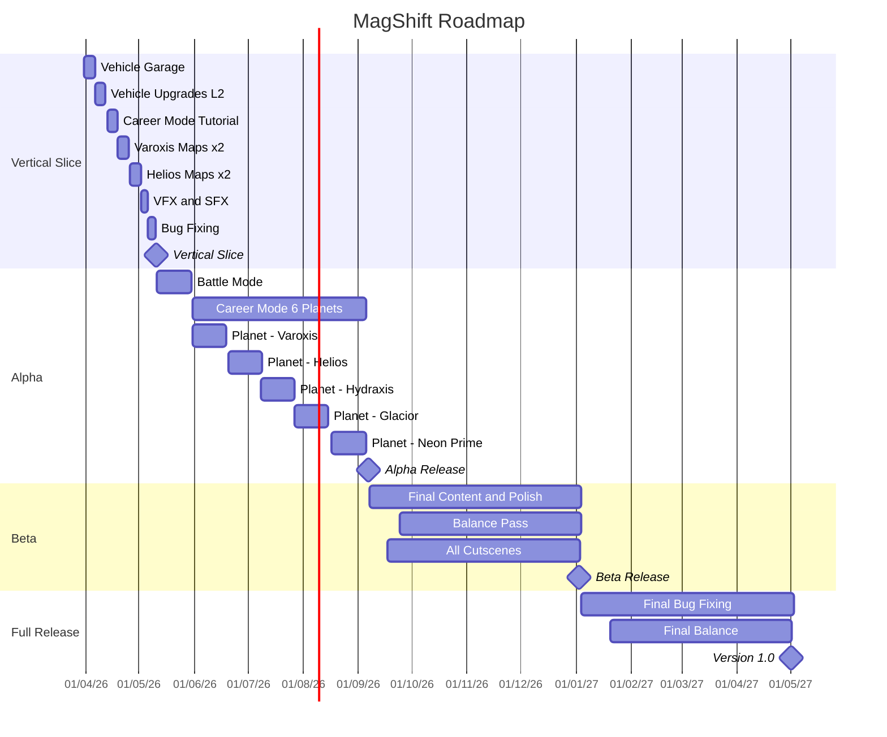

```countdown-to
title: Vertical Slice Deadline
startDate: 2026-01-04
startTime: 08:00:00
endDate: 2026-05-10
endTime: 20:00:00
type: line
color: #ff5722
trailColor: #f5f5f5
infoFormat: {percent}% complete - {remaining} until {end:LLL d, yyyy}
updateInRealTime: true
updateIntervalInSeconds: 30
```

