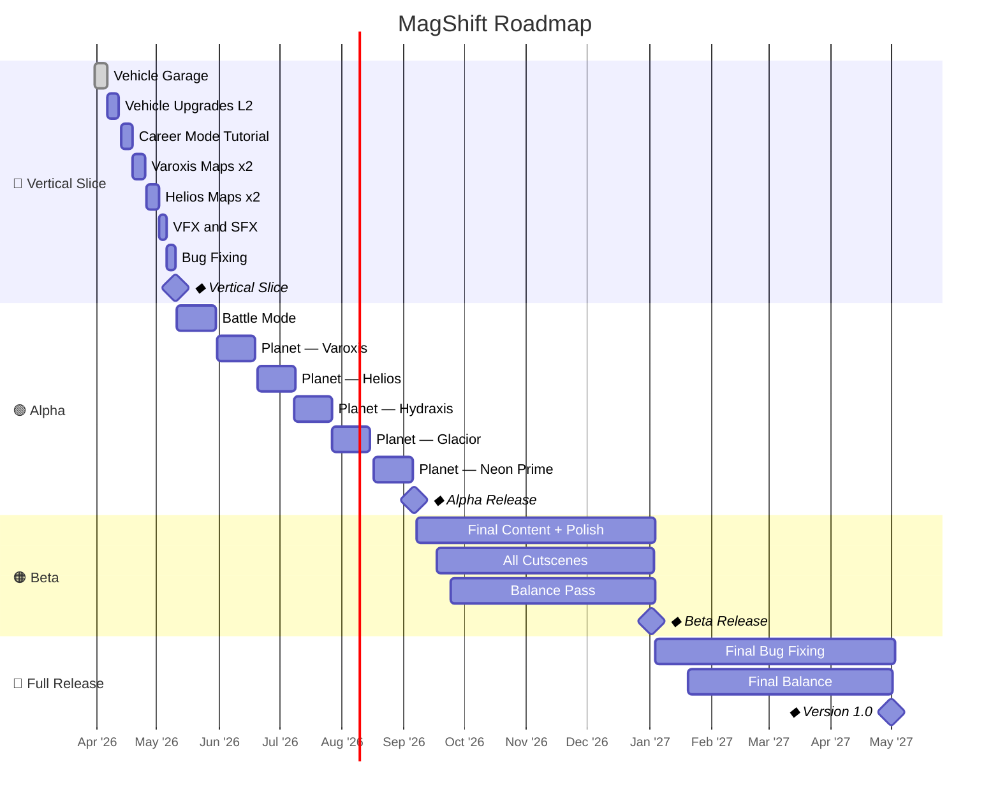

# MagShift — development roadmap

## Phase summary

| Phase | Start | End | Duration |
|---|---|---|---|
| Vertical Slice | 2026-03-31 | 2026-05-10 | 6 weeks |
| Alpha | 2026-05-11 | 2026-09-06 | ~17 weeks |
| Beta | 2026-09-07 | 2027-01-02 | ~17 weeks |
| Full Release | 2027-01-04 | 2027-05-01 | ~17 weeks |

